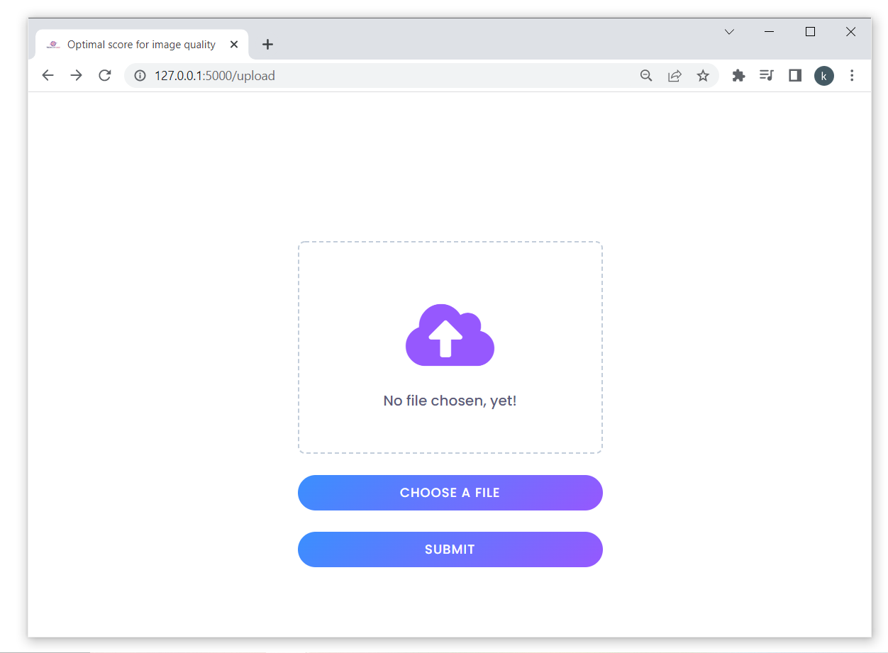

<!-- Improved compatibility of back to top link: See: https://github.com/othneildrew/Best-README-Template/pull/73 -->
<a name="readme-top"></a>

<!-- PROJECT LOGO -->
<br />
<div align="center">
    
<h1 align="center">Optimal score for image quality</h1>
  <p align="center">
    A website which calculates the optimal score for image quality for a given image and saved it on the server.

  <p align="center">
  * the artifacts in the demo is due to gif compression used to save the video
   and not the alogorithm (Feel free to test). 
  </p>
</div>


<!-- ABOUT THE PROJECT -->
## About The Project



The project uses SSIM (Similarity Structural Image Metric) to calculate the optimal score for image quality.

### Features

- [x] Image dimensions remains the same.
- [x] There is minimal noticeable difference between the images.
- [x] Faster and more accurate (no artefacts) than any CNN/GAN based approach (tested). 
- [x] Returns the image pixel density ratio for compression as mentioned in the question.
- [x] No need for GPU on the server.
- [x] Optimizes for human perception visual quality.
- [x] Only saves the optimal image, uploaded image remains in memory buffer.
- [x] No need to download the image from the server.
- [x] Depends on standardized algorithm from `scikit-image`.
- [x] Lower latency than other approaches.
- [x] Very minimal code, to increase maintainabiity.
- [x] Leverages parallelism to speed up the process.
- [x] The algorithm is not dependent on the image size or format.
<p align="right">(<a href="#readme-top">back to top</a>)</p>


<br/>
Structural Similarity Image Metric

### Built With

* python
* flask
* skimage
* Pillow
* torch (alternative backend)

<p align="right">(<a href="#readme-top">back to top</a>)</p>


<!-- GETTING STARTED -->
## Getting Started

Just install the required packages and run the server.


### Prerequisites

* install prerequisites
```sh
pip install -r requirements.txt
```

### Running the server

```sh
python app.py
```


<p align="right">(<a href="#readme-top">back to top</a>)</p>


